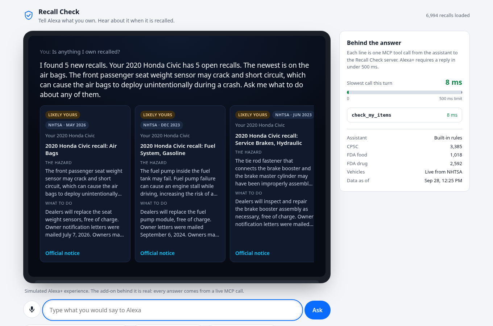
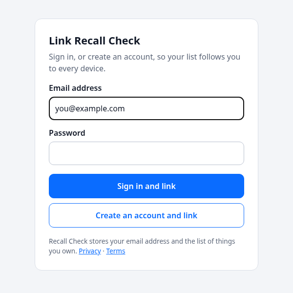

# Recall Check

**Tell Alexa what you own. Hear about it when any of it is recalled, and what to do.**

Recall Check is an Alexa+ add-on: a self-hosted MCP server (spec 2025-11-25, Streamable HTTP) that watches a household's belongings for United States safety recalls. It covers consumer products (CPSC), vehicles (NHTSA), and food and medicine (FDA).

Built for the Alexa+ track of *Build, Ship, Shape: Amazon Developer Hackathon*. MIT licensed.



## The problem

The United States issues hundreds of safety recalls a year. Most owners never hear about the ones that affect them: a recall notice reaches the people who registered the product, and few people register an air fryer or a stroller. To find out, you would have to remember everything you own and search three government websites, repeatedly.

A voice assistant is already in the room with those products. Recall Check lets you say what you own once, in passing, and then does the checking for you.

## A conversation

> **You:** Alexa, add my Cosori air fryer, model CP158-AF.
> **Alexa:** Added your Cosori air fryer, model CP158-AF. Your Cosori air fryer is recalled. Stop using it now. A wire connection in the air fryers can overheat, posing fire and burn hazards. Ask me what to do about it.
>
> **You:** What should I do about it?
> **Alexa:** Stop using your Cosori air fryer now. Consumers should immediately stop using the recalled air fryers and contact Cosori to receive their choice of a free replacement air fryer or another Cosori product. The remedy on offer is a replacement. The contact details and the official notice are in the Alexa app.
>
> **You:** I got the replacement.
> **Alexa:** Done. I will not mention that recall on your Cosori air fryer again.

That exchange is real output from this repository against live recall data.

## What it does

| Tool | When Alexa calls it |
| --- | --- |
| `add_item` | The user mentions owning something. It is saved and checked at once. |
| `check_my_items` | "Is anything I own recalled?" New recalls since the last check come first. |
| `get_recall_guidance` | "What should I do about the stroller?" Whether to stop using it, the remedy, who to contact. |
| `mark_recall_handled` | "I got the refund." The recall is not reported again. |
| `list_items` | "What are you watching?" |
| `remove_item` | "Stop watching the stroller." Asks first and removes only after a yes. |
| `search_recalls` | "Is the Fisher-Price Rock 'n Play recalled?" For things the user does not own yet. |

### How sure it is

A false alarm costs trust and a missed recall costs safety, so Recall Check never reports a match on the brand alone. The recall has to name the maker and the kind of product. The model number then sets the confidence, and the wording follows it:

| Confidence | Meaning | What Alexa says |
| --- | --- | --- |
| confirmed | The recall lists the owner's model number | "Your Cosori air fryer is recalled." |
| likely | Maker and product match, no model number to compare | "...is probably affected by a recall from February 2023." |
| possible | Maker and product match, but the recall lists other model numbers | "There is a recall that may cover your..." |

Vehicle recalls apply to "certain" vehicles of a make, model and year, so they are always reported as likely, with advice to confirm by VIN.

## Meeting the Alexa+ requirements

| Requirement (Amazon's documentation) | How Recall Check meets it |
| --- | --- |
| MCP spec 2025-11-25 over Streamable HTTP | `@modelcontextprotocol/sdk` 1.30, `POST /mcp`, stateless, JSON responses. Older protocol versions are negotiated. |
| Round trip under 500 ms | Answers come from a local index, never from a government API on the answer path. Tool calls measure 3 to 15 ms locally. A vehicle lookup is given 250 ms; if the agency is slower, the item is saved, the user is told the check is running, and the result is stored in the background. |
| Voice responses under 30 seconds | Every answer is built to stay under about 75 words. A test enforces it. |
| No web addresses, ids or JSON in what is spoken | Links and ids travel in `structuredContent` only. A test enforces it across every tool. |
| Explicit confirmation before deletion | `remove_item` answers with a question until it is called with `confirmed: true`. Enforced on the server, not left to the model. |
| Errors as `isError` with something sayable | Every failure returns one sentence Alexa can say. No error codes reach the user. |
| Tool descriptions say when to call, and output matches a declared schema | Each tool declares an `outputSchema`; the SDK validates every result against it. |
| State across sessions | The household list, what has been reported and what has been dealt with persist per user. |
| Service-level authentication (client credentials) | `POST /oauth/token` issues a one-hour `mcp:service` token with no refresh token. With it Alexa+ can initialize, list tools and search recalls. |
| Account linking (OAuth 2.1, PKCE S256) | Authorization code grant, a refresh token with every access token, static clients, the `resource` parameter checked. Tools that work on a household return 401 until an account is linked, which is what makes Alexa+ start linking. |

What remains for a real listing is in [docs/ALEXA-READINESS.md](docs/ALEXA-READINESS.md).

## Account linking

Recall Check is its own authorization server, so it needs no outside identity service. An account is an email address and a password (stored as a salted scrypt hash). It owns one household, and the household is the subject of every token, so a list built by voice in the kitchen is there on the phone.

| Address | What it is |
| --- | --- |
| `/.well-known/oauth-protected-resource` | Tells Alexa+ which authorization server to use (RFC 9728) |
| `/.well-known/oauth-authorization-server` | Endpoints, grants and the PKCE method (RFC 8414) |
| `/oauth/authorize` | The sign-in page the customer sees |
| `/oauth/token` | Codes and refresh tokens are exchanged here |

To see it work, open the simulator and choose **Link an account**. That page plays the part of the Alexa app: it runs the PKCE flow in the browser and shows each step. Link a second browser to the same account and the list is already there.



## The simulated Alexa+ experience

The Alexa+ developer tools are in preview with select partners and are not available to hackathon participants, so this repository includes its own host: a web page styled as an Echo Show, served at `/`.

It is a simulation of the assistant only. The add-on behind it is real. For every utterance the host opens an MCP client connection to `/mcp` over HTTP, exactly as Alexa+ would, calls the tools, and shows each call with its latency against the 500 ms limit.

The host understands utterances with built-in rules, so it runs with no API key. Set `LLM_API_KEY` and `LLM_MODEL` to have a language model choose the tools instead, through any OpenAI-compatible endpoint.

## Run it

[](https://render.com/deploy?repo=https://github.com/G-ojies/recall-check)

Or on your own machine. 
Requires Node.js 20 or newer.

```bash
npm install
npm start        # http://localhost:8787
```

The repository carries a copy of the recall data in `seed/`, so the server answers from its first request. It fetches fresh data in the background when the copy is more than six hours old. `npm run sync` does the same by hand.

Open http://localhost:8787 for the simulator. The MCP endpoint is `POST http://localhost:8787/mcp`.

To call the endpoint directly, set a token first:

```bash
ACCESS_TOKENS=secret:me npm start
npx @modelcontextprotocol/inspector   # connect to http://localhost:8787/mcp with header Authorization: Bearer secret
```

Configuration is in [.env.example](.env.example).

## Tests

```bash
npm test
```

84 tests, no network and no keys needed. They cover matching (including that a brand alone, or a brand mentioned only in a description, never produces a match), the three agency adapters against real record shapes, the household service, what is spoken, the tools called through a real MCP client, the simulator's understanding of utterances, storage, and authentication: codes that work once, PKCE, forged and expired tokens, refresh token rotation, and what a service token may not do.

## How it is built

```
src/
  sources/     one adapter per agency: CPSC, FDA, NHTSA
  text.ts      tokenising and model-number normalising, shared by index and matcher
  match.ts     the recall index and the matching rules
  service.ts   what Recall Check can do, independent of MCP
  speech.ts    every sentence Alexa says
  mcp.ts       the seven tools
  server.ts    HTTP: /mcp, /health, and the simulator
  auth.ts      who is calling
  oauth.ts     the authorization server: service tokens and account linking
  store.ts     households and accounts, in files or in Redis
  host/        the simulated assistant: utterance rules, optional model, MCP client
public/        the simulated device, the account linking page, privacy and terms
seed/          a copy of the recall data, so a new host starts with a full index
addon-package/ the add-on manifest, in the format Amazon's CLI produces, and listing images
```

Recall data is refreshed every six hours. If one agency is down, its rows are carried over from the previous snapshot, so an outage never empties the index.

## Limits

- United States recalls only.
- Meat and poultry recalls (USDA FSIS) are not covered. That agency's API refuses automated requests.
- FDA coverage is ongoing recalls from the last ten years. Medical devices are not yet included.
- Matching is by words and model numbers. It does not read serial numbers, date codes or lot numbers, so "likely" and "possible" results always need a look at the label.
- Recall Check is not affiliated with Amazon or with any government agency. The official notice is the authority.

## Documents

- [docs/ALEXA-READINESS.md](docs/ALEXA-READINESS.md): what is done and what remains for a real Alexa+ listing.
- [docs/FRICTION-LOG.md](docs/FRICTION-LOG.md): what was hard while building against Amazon's developer documentation.
- [docs/PRODUCT-FEEDBACK.md](docs/PRODUCT-FEEDBACK.md): answers to the hackathon's product feedback questions.
- [docs/DEVPOST.md](docs/DEVPOST.md): the submission text.
- [docs/VIDEO.md](docs/VIDEO.md): what the demo video shows, minute by minute.
